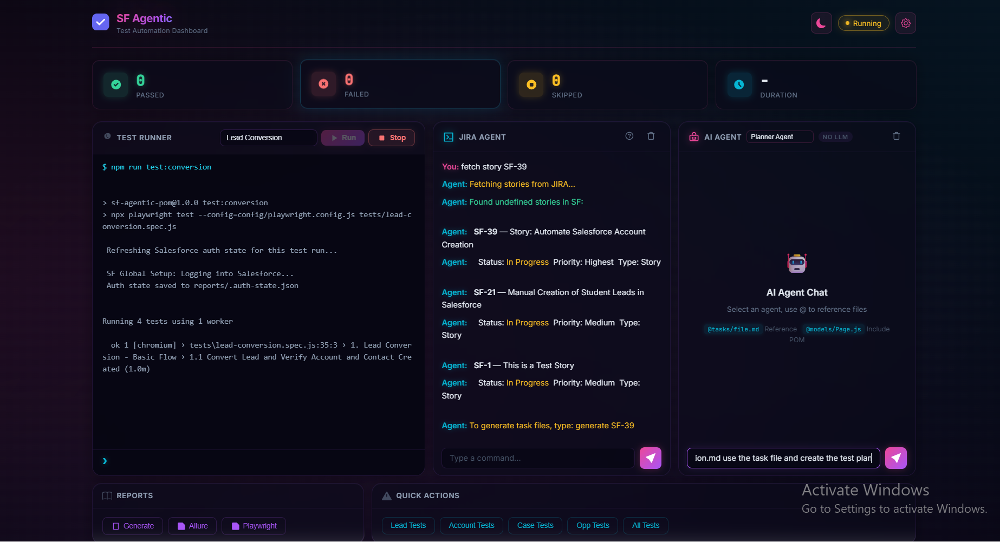

# SF-AgenticOpen

> **AI-Driven Salesforce Test Automation Framework**
> Playwright + Page Object Model + Data-Driven Testing + Self-Healing + JIRA + Teams Alerts + Dashboard

**Data is the pillar.** Every test is driven by structured JSON data, not hardcoded values. AI agents assist with planning, generation, and healing — but data drives everything.

## Stack

| Layer | Technology |
|---|---|
| Test Runner | Playwright Test v1.60+ |
| Architecture | Page Object Model (POM) |
| Data | JSON fixtures + template engine |
| Reporting | Allure 3 + Playwright HTML + JIRA + Teams |
| Self-Healing | Auth validation + auto-retry |
| JIRA Integration | Auto-create bugs on test failure |
| Teams Alerts | Real-time failure notifications |
| API Testing | Salesforce REST API (no jsforce) |
| Dashboard | Express + WebSocket terminal UI |
| CI/CD | Jenkins + GitHub Actions |
| AI Agents | Planner, Generator, Healer |

---

## Installation

### Prerequisites

- **Node.js** v18+ (https://nodejs.org)
- **VS Code** (recommended)
- **Salesforce account** with admin access
- **JIRA account** (Atlassian Cloud)
- **Microsoft Teams** (optional, for failure alerts)

### Step 1: Clone & Install

```bash
git clone https://github.com/rakesh-zoho/SF-AgenticOpen.git
cd SF-AgenticOpen
npm install
npx playwright install chromium
```

### Step 2: Environment Variables

Copy the example and fill in your credentials:

```bash
cp .env.example .env
```

Edit `.env` with your values:

```env
# Salesforce
SF_URL=https://yourorg.my.salesforce.com
SF_USERNAME=your@email.com
SF_PASSWORD=yourpassword
SF_SECURITY_TOKEN=yourtoken
BASE_URL=https://yourorg.my.salesforce.com
HEADLESS=false
SLOW_MO=0
TIMEOUT=60000
CLEANUP=true

# JIRA (Atlassian Cloud)
JIRA_HOST=yourorg.atlassian.net
JIRA_EMAIL=your@email.com
JIRA_API_TOKEN=your-api-token
JIRA_PROJECT_KEY=SF

# Microsoft Teams (optional - leave empty to disable)
TEAMS_WEBHOOK_URL=https://outlook.office.com/webhook/...
```

### Step 3: Generate JIRA API Token

1. Go to https://id.atlassian.com/manage-profile/security/api-tokens
2. Click **Create API token**
3. Copy the token and paste in `.env` as `JIRA_API_TOKEN`

### Step 4: Verify Installation

```bash
npm run test:lead    # Run lead tests
```

---

## How It Works

```
data/*.json  →  data-factory.js  →  tests/*.spec.js  →  models/*.js  →  Salesforce
   (DATA)        (load/resolve)       (test logic)       (POM)          (UI)
```

1. **Data files** define test scenarios with template variables
2. **Data factory** loads, resolves templates (`{{timestamp}}`), merges overrides
3. **Tests** use data to drive page object interactions
4. **Page objects** abstract Salesforce UI interactions
5. **Validators** assert data integrity before/after operations

---

## Project Structure

```
SF-AgenticOpen/
├── data/                          # Test data (JSON) — THE PILLAR
│   ├── lead-test-data.json
│   ├── account-test-data.json
│   ├── opportunity-test-data.json
│   ├── contact-test-data.json
│   ├── contact-mcp-test-data.json # API test data
│   └── case-test-data.json
├── models/                        # Page Object Models
│   ├── BasePage.js                # Shared SF logic
│   ├── LeadPage.js
│   ├── AccountPage.js
│   ├── OpportunityPage.js
│   ├── ContactPage.js
│   ├── CasePage.js
│   ├── AppLauncherPage.js
│   └── LoginPage.js
├── utils/                         # Core utilities
│   ├── data-factory.js            # Data loading, templates, scenarios
│   ├── validators.js              # Schema & assertion helpers
│   ├── locator-utils.js           # SF-specific element interactions
│   ├── sf-helpers.js              # Navigation, auth, load detection
│   ├── sf-api-client.js           # Salesforce REST API client
│   ├── jira-client.js             # JIRA REST API client
│   ├── teams-client.js            # MS Teams webhook client
│   ├── reporter-utils.js          # Allure + JIRA + Teams reporting helpers
│   └── logger.js                  # Structured logging
├── reporters/
│   ├── jira-reporter.js           # Custom Playwright reporter for JIRA
│   └── teams-reporter.js          # Custom Playwright reporter for Teams
├── server/                        # Test Dashboard
│   ├── index.js                   # Express + WebSocket server
│   └── public/
│       ├── index.html             # Dashboard UI
│       └── styles.css             # VS Code-style dark theme
├── fixtures/
│   └── fixtures.js                # Playwright fixtures (sfTest)
├── specs/                         # Test plans & RTM (markdown)
├── tests/                         # Test specs
│   ├── lead-creation.spec.js
│   ├── lead-conversion.spec.js
│   ├── case-creation.spec.js
│   ├── opportunity-creation.spec.js
│   ├── account-creation.spec.js
│   └── contact-mcp-crud.spec.js   # API-based tests
├── tasks/                         # Agent task definitions
├── scripts/
│   └── self-heal.js               # Self-healing test runner
├── config/
│   └── playwright.config.js       # Playwright configuration
├── .github/agents/                # AI agent prompts
├── memory/                        # Agent knowledge base
└── reports/                       # Artifacts (gitignored)
```

---

## Commands

### Run Tests

| Command | Description |
|---|---|
| `npm test` | Run all tests |
| `npm run test:lead` | Lead tests only |
| `npm run test:lead:conversion` | Lead conversion tests |
| `npm run test:case` | Case tests only |
| `npm run test:opportunity` | Opportunity tests only |
| `npm run test:contact:mcp` | Contact API tests (MCP) |
| `npm run test:contact:mcp:keep` | Contact API tests (no cleanup) |

### Self-Healing

| Command | Description |
|---|---|
| `npm run test:heal` | Auto-heal all tests |
| `npm run test:heal:lead` | Self-heal lead tests |
| `npm run test:all` | Self-heal all spec files |

### Debugging

| Command | Description |
|---|---|
| `npm run test:headed` | Visible browser |
| `npm run test:debug` | Step-through debugging |

### Reports

| Command | Description |
|---|---|
| `npm run report:allure` | Open Allure report |
| `npm run report:pw` | Playwright HTML report |

### Dashboard

| Command | Description |
|---|---|
| `npm run dashboard` | Start test dashboard at http://localhost:3000 |
| `node server/index.js` | Start dashboard (alternative) |

---

## JIRA Integration

### How It Works

When any test fails, the framework automatically:

1. **Creates a JIRA issue** in your project (type: Bug)
2. **Attaches the failure screenshot**
3. **Transitions status** to "Captured In Automation"
4. **Includes full details**: test name, file, error, stack trace

### JIRA Issue Format

| Field | Value |
|---|---|
| **Project** | `SF` (configurable via `JIRA_PROJECT_KEY`) |
| **Issue Type** | Bug |
| **Summary** | `[AUTOMATION] {Test Name} - FAILED` |
| **Labels** | `automation`, `playwright`, `{feature-name}` |
| **Priority** | Mapped from test title (p1→Highest, p2→High, default→Medium) |
| **Attachment** | Failure screenshot (PNG) |
| **Status** | Auto-transitioned to "Captured In Automation" |

### Example JIRA Issue

```
Summary: [AUTOMATION] MCP-01: Create Contact via API - FAILED
Description:
  Test: MCP-01: Create Contact via API
  File: tests/contact-mcp-crud.spec.js:15
  Status: failed
  Duration: 2.3s

  Error: expect(received).toBe(expected)
  Expected: "Active"
  Received: "Draft"

  Stack Trace: ...
Attachment: test-failed-1.png
```

### Disabling JIRA Reporter

Set `JIRA_HOST` or `JIRA_API_TOKEN` to empty in `.env`:

```env
JIRA_HOST=
JIRA_API_TOKEN=
```

---

## Microsoft Teams Integration

### How It Works

When any test fails, the framework sends a real-time alert to your Microsoft Teams channel:

1. **Detects failure** on test end
2. **Builds Adaptive Card** with test details
3. **Posts to webhook** URL configured in `.env`
4. **Includes**: test name, error, duration, file location

### Setting Up Teams Webhook

1. Open MS Teams → Select channel → **Connectors** (or **Workflows**)
2. Add **Incoming Webhook** connector
3. Copy the webhook URL
4. Paste in `.env`:

```env
TEAMS_WEBHOOK_URL=https://outlook.office.com/webhook/your-webhook-url
```

### Teams Alert Card

```
🚨 Automation Test Failure
─────────────────────────────
Test:    MCP-01: Create Contact via API
Status:  failed
Duration: 2.30s
File:    tests/contact-mcp-crud.spec.js:15
Project: Salesforce Agentic Automation

Error Detail:
expect(received).toBe(expected)
```

### Enable/Disable

```env
# Enabled — paste your webhook URL
TEAMS_WEBHOOK_URL=https://outlook.office.com/webhook/...

# Disabled — leave empty or remove the line
TEAMS_WEBHOOK_URL=
```

### Adding Teams Step to CI/CD

```yaml
# GitHub Actions
- name: Run Tests
  run: npm test
  env:
    TEAMS_WEBHOOK_URL: ${{ secrets.TEAMS_WEBHOOK_URL }}
```

---

## Test Dashboard

A browser-based terminal UI for running tests, viewing reports, and managing environment variables — no CLI required.



### Starting the Dashboard

```bash
# Option 1: npm script
npm run dashboard

# Option 2: direct node
node server/index.js
```

Then open **http://localhost:3000** in your browser.

### Dashboard Features

| Feature | Description |
|---|---|
| **Test Runner** | Select a suite from dropdown, click Run — output streams live in terminal |
| **Stop Button** | Terminate a running test mid-execution |
| **Stats Bar** | Real-time Passed / Failed / Skipped / Duration counters |
| **Generate Report** | Generates both Allure + Playwright HTML reports from latest results |
| **Open Reports** | Opens Allure or Playwright report in a new tab (served on port 3000) |
| **.env Editor** | Edit environment variables without leaving the browser |
| **Terminal Input** | Type any command (e.g. `npm run test:lead`) and press Enter |
| **Auto-Generate** | Reports auto-generate after each test run completes |

### Available Test Suites

| Suite | Command |
|---|---|
| Lead Creation | `npm run test:lead` |
| Lead Conversion | `npm run test:conversion` |
| Opportunity Creation | `npm run test:opportunity` |
| Account Creation | `npm run test:account` |
| Case Creation | `npm run test:case` |
| Contact MCP (API) | `npm run test:contact:mcp:keep` |
| All Tests | `npm test` |

### Dashboard Workflow

1. Select a test suite from the dropdown
2. Click **Run** — tests execute, output streams live
3. When done, reports auto-generate
4. Click **Open Playwright** or **Open Allure** to view reports
5. Or click **Generate Report** to manually regenerate

### Configuration

| Variable | Default | Description |
|---|---|---|
| `DASHBOARD_PORT` | `3000` | Dashboard server port |

```env
# Optional: change dashboard port
DASHBOARD_PORT=4000
```

---

## Data-Driven Testing

### Template Variables

| Template | Resolves To |
|---|---|
| `{{timestamp}}` | Unix timestamp |
| `{{datePlus30}}` | Date 30 days from now |
| `{{uuid}}` | Unique identifier |
| `{{randomEmail}}` | Random test email |
| `{{randomPhone}}` | Random test phone |

### Loading Data

```javascript
import { loadData } from '../utils/data-factory.js';

const data = loadData('lead', 'allStandardFields');
// data.firstName = "Jane", data.lastName = "Smith-1721847123456"

// With overrides
const data = loadData('lead', 'basic', { company: 'Override Corp' });
```

### Data File Format

```json
{
  "scenarios": {
    "basic": {
      "firstName": "Jane",
      "lastName": "Smith-{{timestamp}}",
      "company": "Test Corp",
      "email": "jane.smith-{{timestamp}}@test.com"
    },
    "allStandardFields": {
      "firstName": "John",
      "lastName": "Doe-{{timestamp}}",
      "company": "Enterprise Inc",
      "email": "john.doe-{{timestamp}}@test.com",
      "phone": "{{randomPhone}}",
      "title": "VP of Sales"
    }
  }
}
```

---

## Salesforce API Testing (MCP)

### Overview

Tests can run against Salesforce REST API directly, without a browser. Uses browser session tokens for auth (no jsforce dependency).

### Available API Tests

| Test | Description |
|---|---|
| MCP-01 | Create Contact via API |
| MCP-02 | Get Contact by ID |
| MCP-03 | Update Contact |
| MCP-04 | Delete Contact |
| MCP-05 | Query Contacts |
| MCP-06 | Batch Create Contacts |
| MCP-07 | Negative: Invalid Email |
| MCP-08 | Negative: Missing Required Fields |

### Running API Tests

```bash
npm run test:contact:mcp        # Run with cleanup
npm run test:contact:mcp:keep   # Run without deleting records
```

### Writing API Tests

```javascript
import { test, expect } from '@playwright/test';
import { apiStep, attachJson } from '../utils/reporter-utils.js';

test('Create Contact', async ({ apiClient }) => {
  const data = { firstName: 'John', lastName: 'Doe', email: 'john@test.com' };

  await apiStep('Create Contact', async () => {
    const response = await apiClient.post('/services/data/v62.0/sobjects/Contact/', data);
    await attachJson('Create Response', response);
    expect(response.id).toBeTruthy();
  });
});
```

---

## AI Agents

### Overview

Three AI agents work together to automate test creation:

| Agent | Role | Input | Output |
|---|---|---|---|
| **Planner** | Explores SF via MCP, creates test plans | Salesforce object | `specs/<object>-plan.md` |
| **Generator** | Reads plans, generates test code | Test plan | `tests/<object>-*.spec.js` + `data/<object>-test-data.json` |
| **Healer** | Analyzes failures, fixes tests | Failed test output | Fixed test code |

### Agent Workflow

```
Task File → Planner Agent → Generator Agent → Healer Agent
   ↓              ↓               ↓                ↓
tasks/         specs/          tests/           Fixed tests
*.md           *-plan.md       *.spec.js
```

### Step 1: Create a Task File

Create `tasks/<object>-flow.md`:

```markdown
# Object: Contact

## Fields to Test
- First Name (required)
- Last Name (required)
- Email
- Phone
- Account Name (lookup)

## Test Scenarios
1. Create with all fields
2. Create with required fields only
3. Update existing record
4. Delete record
5. Negative: missing required fields

## Data File
data/contact-test-data.json
```

### Step 2: Run Planner Agent

In VS Code Copilot Chat:

```
@agent Read tasks/contact-flow.md and create a test plan.
Explore the Contact object in Salesforce via MCP.
Save the plan to specs/contact-plan.md.
Follow the format in .github/agents/planner-prompt.md.
```

### Step 3: Run Generator Agent

```
@agent Read specs/contact-plan.md and generate tests.
Create data/contact-test-data.json with all scenarios.
Create tests/contact-creation.spec.js using POM.
Follow the format in .github/agents/generator-prompt.md.
Use BasePage methods: navigateToNew(), fillRecord(), selectPicklist(), saveRecord().
Assert with assertRecordCreated() after every save.
```

### Step 4: Run Healer Agent (if tests fail)

```
@agent These tests are failing: [paste output]
Fix the tests using the Healer agent.
Check models/BasePage.js for available methods.
Check utils/sf-helpers.js for SF-specific helpers.
Follow the format in .github/agents/healer-prompt.md.
```

### Agent Knowledge Base

Agents reference these files for context:

| File | Purpose |
|---|---|
| `memory/framework-memory.md` | Framework conventions & rules |
| `memory/pom-patterns.md` | POM method patterns |
| `memory/sf-selectors.md` | Salesforce UI selectors |
| `.github/agents/planner-prompt.md` | Planner agent instructions |
| `.github/agents/generator-prompt.md` | Generator agent instructions |
| `.github/agents/healer-prompt.md` | Healer agent instructions |

---

## Page Object Model

### BasePage Methods

| Method | Description |
|---|---|
| `navigateToNew()` | Navigate to new record page |
| `fillField(label, value)` | Fill a text field by label |
| `selectPicklist(label, value)` | Select a picklist value |
| `selectLookup(label, search)` | Select a lookup record |
| `saveRecord()` | Click Save and wait for load |
| `assertRecordCreated()` | Toast + URL + heading assertion |
| `waitForSFLoad()` | Wait for SF Lightning to load |

### Creating a New Page Object

```javascript
import { BasePage } from './BasePage.js';

export class ContactPage extends BasePage {
  constructor(page) {
    super(page);
  }

  async fillContact(data) {
    await this.fillField('First Name', data.firstName);
    await this.fillField('Last Name', data.lastName);
    await this.fillField('Email', data.email);
    if (data.accountName) {
      await this.selectLookup('Account Name', data.accountName);
    }
  }
}
```

---

## Reporting

### Allure Report

```bash
npm run report:allure    # Opens Allure report in browser
```

Features:
- Test steps with screenshots
- Duration trends
- Category breakdown
- Retry history

### Playwright HTML Report

```bash
npm run report:pw    # Opens Playwright report
```

Features:
- Trace viewer
- Video playback
- DOM snapshots

### JIRA Reports

Failed tests auto-create JIRA issues with:
- Full error details
- Stack trace
- Failure screenshot
- Auto-transition to "Captured In Automation"

### Teams Alerts

Failed tests send real-time notifications to MS Teams:
- Red-themed Adaptive Card
- Test name, status, duration
- Error message and file location
- Configurable via `TEAMS_WEBHOOK_URL` in `.env`

---

## CI/CD

### Jenkins

```groovy
pipeline {
  agent any
  stages {
    stage('Test') {
      steps {
        sh 'npm install'
        sh 'npx playwright install chromium'
        sh 'npm test'
      }
    }
    stage('Report') {
      steps {
        allure includeProperties: false, results: [[path: 'reports/allure-results']]
      }
    }
  }
}
```

### GitHub Actions

```yaml
- name: Run Tests
  run: |
    npm install
    npx playwright install chromium
    npm test

- name: Allure Report
  uses: simple-elf/allure-report-action@master
  with:
    allure_results: reports/allure-results
```

---

## Troubleshooting

### Common Issues

| Issue | Solution |
|---|---|
| `net::ERR_CERT_AUTHORITY_INVALID` | Set `ignoreHTTPSErrors: true` in config |
| Auth expired | Run `npm run test:heal` to re-login |
| `networkidle` timeout | Use `waitForSFLoad()` instead |
| Picklist closes dialog | Check `selectPicklist()` uses correct approach |
| JIRA 415 error | Check API token is valid |
| JIRA issue not created | Check `JIRA_HOST` and `JIRA_API_TOKEN` in `.env` |

### Reset Auth

```bash
rm reports/.auth-state.json
npm run test:heal
```

### Debug Mode

```bash
npx playwright test --debug --config config/playwright.config.js
```

---

## Environment Variables Reference

| Variable | Required | Default | Description |
|---|---|---|---|
| `SF_URL` | Yes | - | Salesforce login URL |
| `SF_USERNAME` | Yes | - | Salesforce username |
| `SF_PASSWORD` | Yes | - | Salesforce password |
| `SF_SECURITY_TOKEN` | Yes | - | Salesforce security token |
| `BASE_URL` | Yes | - | Salesforce org URL |
| `HEADLESS` | No | `true` | Run in headless mode |
| `SLOW_MO` | No | `0` | Slow down actions (ms) |
| `TIMEOUT` | No | `60000` | Test timeout (ms) |
| `CLEANUP` | No | `true` | Delete test records after |
| `JIRA_HOST` | No | - | JIRA instance hostname |
| `JIRA_EMAIL` | No | - | JIRA login email |
| `JIRA_API_TOKEN` | No | - | JIRA API token |
| `JIRA_PROJECT_KEY` | No | `SF` | JIRA project key |
| `TEAMS_WEBHOOK_URL` | No | - | MS Teams webhook URL (empty = disabled) |

---

## License

Internal use only.
